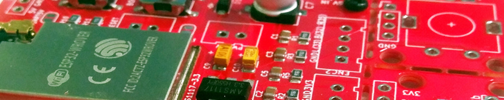
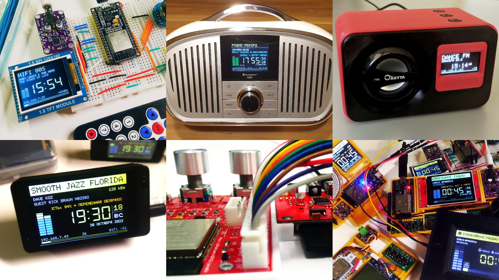
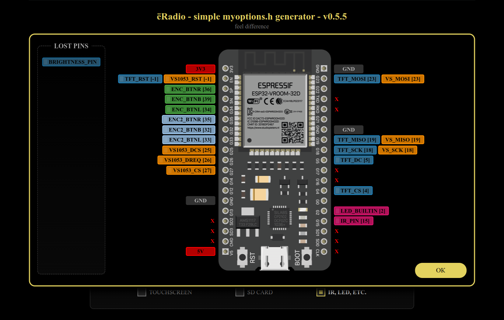
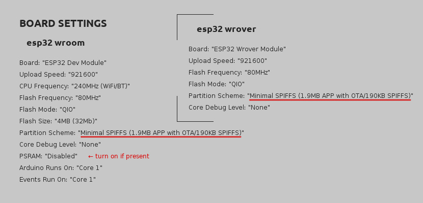
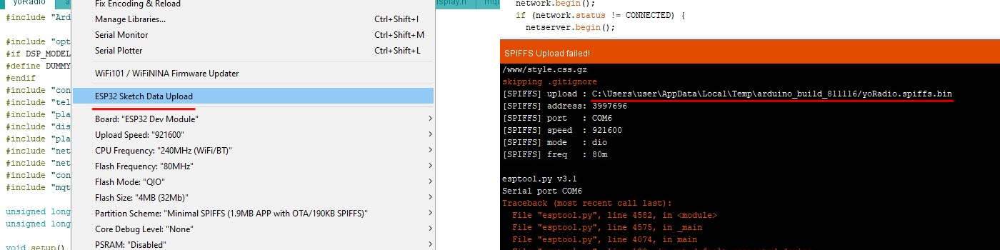
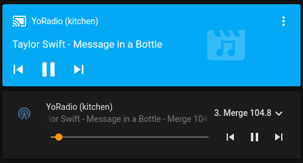

[GitHub репозиторий исходной версии](https://github.com/e2002/yoradio)

# ёRadio


##### Web-radio based on [ESP32-audioI2S](https://github.com/schreibfaul1/ESP32-audioI2S) or/and [ESP32-vs1053_ext](https://github.com/schreibfaul1/ESP32-vs1053_ext) library
---
- [Hardware](#hardware)
- [Connection tables](#connection-tables)
- [Software dependencies](#dependencies)
- [Hardware setup](#hardware-setup)
- [Quick start](#quick-start)
- [Detailed start](https://github.com/e2002/yoradio/wiki/How-to-flash)
- [Update](#update)
- [Update over web-interface](#update-over-web-interface)
- [Controls](Controls.md)
- [MQTT](#mqtt)
- [Home Assistant](#home-assistant)
- [More features](#more-features)
- [Plugins](#plugins)
- [Описание на 4PDA](https://4pda.to/forum/index.php?s=&showtopic=1010378&view=findpost&p=112992611)
---
#### NEW!
##### yoRadio Printed Circuit Boards repository:
[](https://github.com/e2002/yopcb)

https://github.com/e2002/yopcb

---


##### More images in [Images.md](Images.md)

---
## Hardware
#### Required:
**ESP32 board**: https://aliexpress.com/item/32847027609.html \
**I2S DAC**, roughly like this one: https://aliexpress.com/item/1005001993192815.html \
https://aliexpress.com/item/1005002011542576.html \
or **VS1053b module** : https://aliexpress.com/item/32893187079.html \
https://aliexpress.com/item/32838958284.html \
https://aliexpress.com/item/32965676064.html

#### Optional:
##### Displays
- **ST7735** 1.8' or 1.44' https://aliexpress.com/item/1005002822797745.html
- or **SSD1306** 0.96' 128x64 I2C https://aliexpress.com/item/1005001621806398.html
- or **SSD1306** 0,91' 128x32 I2C https://aliexpress.com/item/32798439084.html
- or **Nokia5110** 84x48 SPI https://aliexpress.com/item/1005001621837569.html
- or **ST7789** 2.4' 320x240 SPI https://aliexpress.com/item/32960241206.html
- or **ST7789** 1.3' 240x240 SPI https://aliexpress.com/item/32996979276.html
- or **SH1106** 1.3' 128x64 I2C https://aliexpress.com/item/32683094040.html
- or **LCD1602** 16x2 I2C https://aliexpress.com/item/32305776560.html
- or **LCD1602** 16x2 without I2C https://aliexpress.com/item/32305776560.html
- or **SSD1327** 1.5' 128x128 I2C https://aliexpress.com/item/1005001414175498.html
- or **ILI9341** 3.2' 320x240 SPI https://aliexpress.com/item/33048191074.html
- or **ILI9341** 2.8' 320x240 SPI https://aliexpress.com/item/1005004502250619.html
- or **SSD1305 (SSD1309)** 2.4' 128x64 SPI/I2C https://aliexpress.com/item/32950307344.html
- or **SH1107** 0.96' 128x64 I2C https://aliexpress.com/item/4000551696674.html
- or **GC9106** 0.96' 160x80 SPI (looks like ST7735S, but it's not him) https://aliexpress.com/item/32947890530.html
- or **LCD2004** 20x4 I2C https://aliexpress.com/item/32783128355.html
- or **LCD2004** 20x4 without I2C https://aliexpress.com/item/32783128355.html
- or **ILI9225** 2.0' 220x176 SPI https://aliexpress.com/item/32952021835.html
- or **Nextion displays** - [more info](https://github.com/e2002/yoradio/tree/main/nextion)
- or **ST7796** 3.5' 480x320 SPI https://aliexpress.com/item/1005004632953455.html?sku_id=12000029911293172
- or **GC9A01A** 1.28' 240x240 https://aliexpress.com/item/1005004069703494.html?sku_id=12000029869654615
- or **ILI9488** 3.5' 480x320 SPI https://aliexpress.com/item/1005001999296476.html?sku_id=12000018365356570
- or **ILI9486** (Testing mode) 3.5' 480x320 SPI https://aliexpress.com/item/1005001999296476.html?sku_id=12000018365356568
- or **SSD1322** 2.8' 256x64 SPI https://aliexpress.com/item/1005003480981568.html
- or **ST7920** 2.6' 128x64 SPI https://aliexpress.com/item/32699482638.html

(see [Wiki](https://github.com/e2002/yoradio/wiki/Available-display-models) for more details)

##### Controls
- Three tact buttons https://www.aliexpress.com/item/32907144687.html
- Encoder https://www.aliexpress.com/item/32873198060.html
- Joystick https://aliexpress.com/item/4000681560472.html \
https://aliexpress.com/item/4000699838567.html
- IR Control https://www.aliexpress.com/item/32562721229.html \
https://www.aliexpress.com/item/33009687492.html
- Touchscreen https://aliexpress.com/item/33048191074.html

##### RTC
- DS1307 or DS3231 https://aliexpress.com/item/4001130860369.html

---
## Connection tables
##### Use [this tool](https://e2002.github.io/docs/myoptions-generator.html) to build your own connection table and myoptions.h file.
<br />

https://e2002.github.io/docs/myoptions-generator.html

---
## Dependencies
#### Libraries:
**Library Manager**: Adafruit_GFX, Adafruit_ST7735\*, Adafruit_SSD1306\*, Adafruit_PCD8544\*, Adafruit_SH110X\*, Adafruit_SSD1327\*, Adafruit_ILI9341\*, Adafruit_SSD1305\*, TFT_22_ILI9225\* (\* depending on display model), OneButton, IRremoteESP8266, XPT2046_Touchscreen, RTCLib \
**Github**: ~~[ESPAsyncWebServer](https://github.com/me-no-dev/ESPAsyncWebServer), [AsyncTCP](https://github.com/me-no-dev/AsyncTCP), [async-mqtt-client](https://github.com/marvinroger/async-mqtt-client) (if you need MQTT support)~~ <<< **starting with version 0.8.920, these libraries have been moved into the project, and there is no need to install them additionally.**

#### Tool:
[ESP32 Filesystem Uploader](https://randomnerdtutorials.com/install-esp32-filesystem-uploader-arduino-ide/)

**See [wiki](https://github.com/e2002/yoradio/wiki/How-to-flash#preparing) for details**

---
## Hardware setup
Don't edit the options.h! \
Hardware is adjustment in the **[myoptions.h](examples/myoptions.h)** file.

**Important!**
You must choose between I2S DAC and VS1053 by disabling the second module in the settings:
````c++
// If I2S DAC used:
#define I2S_DOUT      27
#define VS1053_CS     255
// If VS1053 used:
#define I2S_DOUT      255
#define VS1053_CS     27
````
Define display model:
````c++
#define DSP_MODEL  DSP_ST7735 /*  default - DSP_DUMMY  */
````
The ST7735 display submodel:
````c++
#define DTYPE INITR_BLACKTAB // 1.8' https://aliexpress.ru/item/1005002822797745.html
//#define DTYPE INITR_144GREENTAB // 1.44' https://aliexpress.ru/item/1005002822797745.html
````
Rotation of the display:
````c++
#define TFT_ROTATE 3 // 270 degrees
````
##### Note: If INITR_BLACKTAB dsp have a noisy line on one side of the screen, then in Adafruit_ST7735.cpp:
````c++
  // Black tab, change MADCTL color filter
  if ((options == INITR_BLACKTAB) || (options == INITR_MINI160x80)) {
    uint8_t data = 0xC0;
    sendCommand(ST77XX_MADCTL, &data, 1);
    _colstart = 2; // ← add this line
    _rowstart = 1; // ← add this line
  }
````

---
## Quick start
<br />

- <span style="color: red; font-weight: bold; font-size: 22px;text-decoration: underline;">Arduino IDE version 2.x.x is not supported. Use Arduino IDE 1.8.19</span>
- <span style="color: red; font-weight: bold; font-size: 22px;text-decoration: underline;">ESP32 core version 2.0.0 or higher is [required](https://github.com/espressif/arduino-esp32)!</span>
1. Generate a myoptions.h file for your hardware configuration using [this tool](https://e2002.github.io/docs/myoptions-generator.html).
2. Put myoptions.h file next to yoRadio.ino.
3. Replace file Arduino/libraries/Adafruit_GFX_Library/glcdfont.c with file [yoRadio/fonts/glcdfont.c](yoRadio/fonts/glcdfont.c)
4. Restart Arduino IDE.
5. In ArduinoIDE - upload sketch data via Tools→ESP32 Sketch Data Upload ([it's here](images/board2.jpg))
6. Upload the sketch to the board
7. Connect to yoRadioAP access point with password 12345987, go to http://192.168.4.1/ configure and wifi connections.  \
_\*this step can be skipped if you add WiFiSSID WiFiPassword pairs to the [yoRadio/data/data/wifi.csv](yoRadio/data/data/wifi.csv) file (tab-separated values, one line per access point) before uploading the sketch data in step 1_
8. After successful connection go to http://\<yoipaddress\>/ , add stations to playlist (or import WebStations.txt from KaRadio)
9. Well done!

**See [wiki](https://github.com/e2002/yoradio/wiki/How-to-flash#build--flash) for details**

---
## Update
1. Backup your settings: \
download _http://\<yoradioip\>/data/playlist.csv_ and _http://\<yoradioip\>/data/wifi.csv_ and place them in the yoRadio/data/data/ folder
2. In ArduinoIDE - upload sketch data via Tools→ESP32 Sketch Data Upload
3. Upload the sketch to the board
4. Go to page _http://\<yoradioip\>/_ in the browser and press Ctrl+F5 to update the scripts.
5. Well done!

## Update over web-interface
1. Backup your settings: \
download _http://\<yoradioip\>/data/playlist.csv_ and _http://\<yoradioip\>/data/wifi.csv_ and place them in the yoRadio/data/data/ folder
2. Get firmware binary: Sketch → Export compiled binary
3. Get SPIFFS binary: disconnect ESP32 from your computer, click on **ESP32 Data Sketch Upload**. \
 You will get an error and file path

 

4. Go to page _http://\<yoradioip\>/update_ and upload yoRadio.ino.esp32.bin and yoRadio.spiffs.bin in turn, checking the appropriate upload options.
5. Well done!

---
## MQTT
1. Copy file examples/mqttoptions.h to yoRadio/ directory
2. In the mqttoptions.h file, change the options to the ones you need
3. Well done!

---
## Home Assistant
<br />

0. Requires [MQTT integration](https://www.home-assistant.io/integrations/mqtt/)
1. Copy directory HA/custom_components/yoradio to .homeassistant/custom_components/
2. Add yoRadio entity into .homeassistant/configuration.yaml ([see example](HA/example_configuration.yaml))
3. Restart Home Assistant
4. Add Lovelace Media Player card to UI (or [mini-media-player](https://github.com/kalkih/mini-media-player) card)
5. Well done!

---
## More features
- Can add up to 65535 stations to a playlist. Supports and imports [KaRadio](https://github.com/karawin/Ka-Radio32) playlists (WebStations.txt)
- Telnet with KaRadio format output \
  **see [list of available commands](https://github.com/e2002/yoradio/wiki/List-of-available-commands-(UART-telnet-GET-POST))**

- MQTT support \
 **Topics**: \
 **MQTT_ROOT_TOPIC/command**     - Commands \
 **MQTT_ROOT_TOPIC/status**      - Player status \
 **MQTT_ROOT_TOPIC/playlist**    - Playlist URL \
 **MQTT_ROOT_TOPIC/volume**      - Current volume \
 **Commands**: \
 **prev**          - prev station \
 **next**          - next station \
 **toggle**        - start/stop playing \
 **stop**          - stop playing \
 **start, play**   - start playing \
 **boot, reboot**  - reboot \
 **volm**          - step vol down \
 **volp**          - step vol up \
 **vol x**         - set volume \
 **play x**        - play station x

- Home Assistant support

---
## Plugins
There is no documentation yet, you will have to deal with the examples, which is in directory [examples/plugins/](https://github.com/e2002/yoradio/tree/main/examples/plugins).\
Work is in progress...
